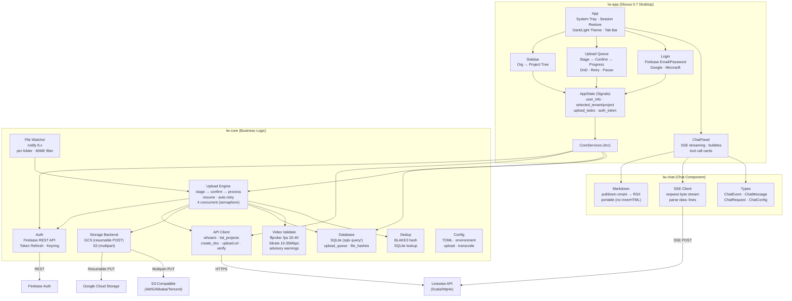
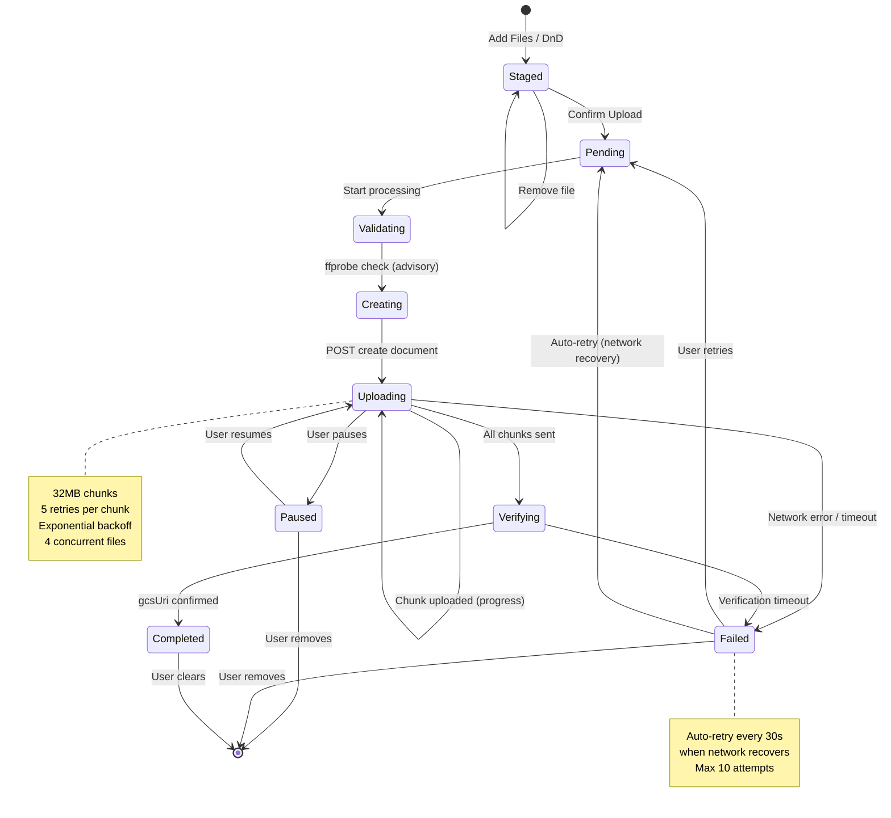
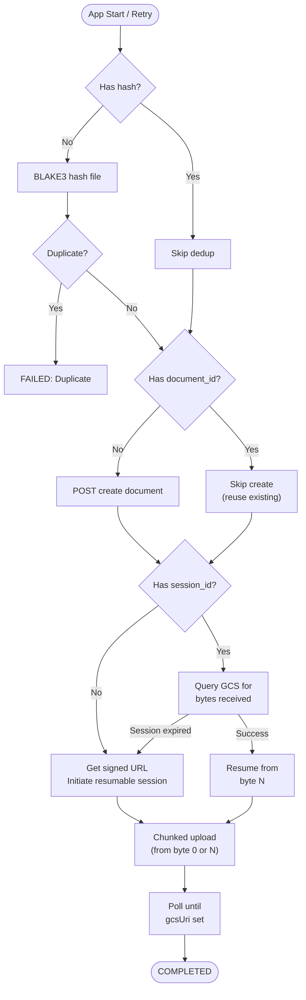
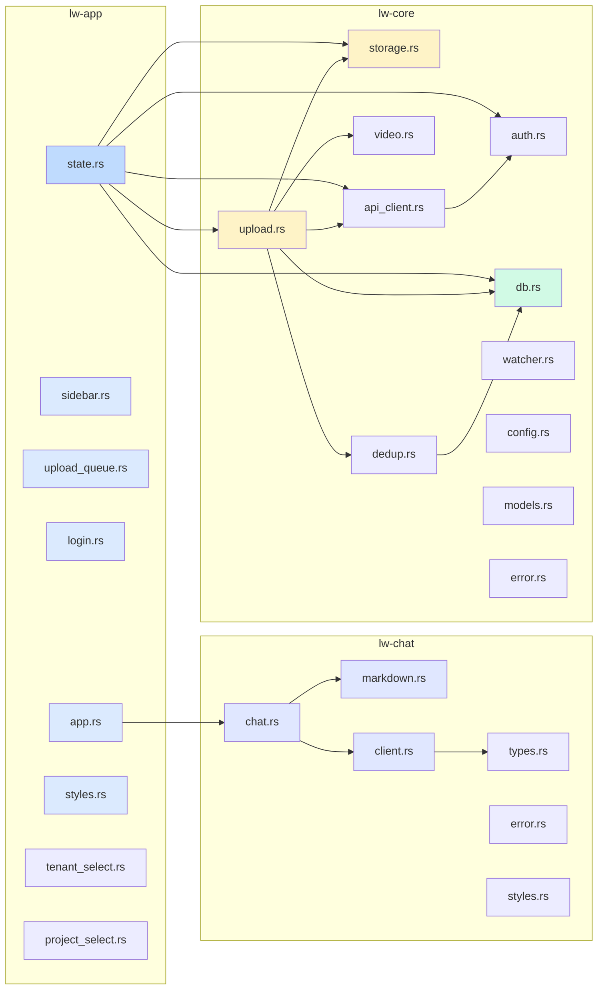

# Architecture — Linewise Desktop

## System Overview



## Upload Flow



## Resume Logic



## Module Structure



## Module Descriptions

### lw-app (Desktop UI — Dioxus 0.7)

| Module | File | Purpose |
|--------|------|---------|
| **App** | `app.rs` | Root component, system tray, session restore, global CSS with dark/light theme, Upload/Chat tab bar |
| **Sidebar** | `components/sidebar.rs` | Two-level org→project tree, expand/collapse, project selection |
| **Upload Queue** | `components/upload_queue.rs` | Two-step upload (stage→confirm), DnD, progress, history, retry/pause/resume/remove |
| **Login** | `components/login.rs` | Email/password login, OAuth buttons (Google, Microsoft) |
| **Tenant Select** | `components/tenant_select.rs` | Organization dropdown (used in sidebar) |
| **Project Select** | `components/project_select.rs` | Project dropdown (used in sidebar) |
| **State** | `state.rs` | `AppState` (Dioxus Signals) + `CoreServices` (Arc shared services) |
| **Styles** | `styles.rs` | Fixed-px layout constants, CSS variable button/input/select styles |

### lw-chat (Chat Component — self-contained)

| Module | File | Purpose |
|--------|------|---------|
| **ChatPanel** | `chat.rs` | Main chat UI: message list, streaming bubbles, tool call cards, input bar. Configurable via `ChatConfig` |
| **Markdown** | `markdown.rs` | Portable pulldown-cmark → RSX renderer. Intermediate `MdNode` tree, no `dangerous_inner_html`. Handles all CommonMark + GFM extensions |
| **SSE Client** | `client.rs` | Streaming HTTP client: POST to chat/completions, parse SSE `data:` lines into `ChatEvent` stream. Error-tolerant (yields parse errors, doesn't stop) |
| **Types** | `types.rs` | `ChatMessage`, `ChatRole`, `ChatEvent` (6 variants: text_delta, thinking_delta, tool_call_start/delta/result, done), `ChatRequest`, `ChatContext`, `ChatMode` |
| **Error** | `error.rs` | `ChatError`: Network, Api, Parse |
| **Styles** | `styles.rs` | `CHAT_CSS` constant: chat panel + markdown content CSS with CSS variable tokens |

### lw-core (Business Logic — zero UI deps)

| Module | File | Purpose |
|--------|------|---------|
| **Auth** | `auth.rs` | Firebase Auth REST API: email sign-in, token refresh (50min), OS keychain storage |
| **API Client** | `api_client.rs` | Linewise backend client: whoami, list_projects, create_document, upload-url, verify |
| **Upload Engine** | `upload.rs` | Orchestrates: stage → confirm → hash → validate → transcode → create → upload → verify. Resumable with auto-retry on network recovery |
| **Storage** | `storage.rs` | Cloud-agnostic enum: `GcsBackend` (resumable POST) + `S3Backend` (multipart). Per-chunk retry with exponential backoff |
| **Database** | `db.rs` | SQLite via sqlx with `query!` macros. Tables: `upload_queue`, `file_hashes`. Async pool |
| **Video** | `video.rs` | ffprobe validation: fps 20-40, bitrate 10-35Mbps, resolution ≥720p. Advisory warnings + camera guide link |
| **Dedup** | `dedup.rs` | BLAKE3 file hashing → SQLite `file_hashes` lookup |
| **Watcher** | `watcher.rs` | `notify` 8.x file system watcher: per-folder with tenant/project mapping, MIME filter, 2s debounce |
| **Config** | `config.rs` | TOML config: server environment, upload prefs, transcode, camera detection, watch folders |
| **Models** | `models.rs` | Domain types mirroring Scala backend DTOs (source of truth: linewise-api) |
| **Error** | `error.rs` | ADT error enums: `AuthError`, `UploadError`, `VideoValidationError`, `DbError`, `ConfigError`, `AppError` |

## Tech Stack

| Layer | Technology |
|-------|-----------|
| UI Framework | Dioxus 0.7 (desktop webview) |
| HTTP | reqwest 0.13 (rustls, 300s timeout) |
| Database | SQLite via sqlx 0.8 (`query!` macros) |
| File Watching | notify 8.x + notify-debouncer-mini |
| File Dialog | rfd 0.17 |
| Video Probing | ffprobe (std::process::Command) |
| File Hashing | BLAKE3 |
| Credentials | keyring 3.x (OS keychain) |
| System Tray | tray-icon (via Dioxus desktop) |
| Theming | CSS variables + `@media (prefers-color-scheme: dark)` |
| Markdown | pulldown-cmark 0.12 (portable RSX renderer) |
| Streaming | async-stream + tokio-stream (SSE parsing) |

## Configuration

```toml
# ~/Library/Application Support/linewise-desktop/config.toml

[server]
environment = "dev"  # dev | testing | production

[upload]
auto_clean = true
chunk_size_mb = 32
max_concurrent_uploads = 4

[camera]
auto_detect = true              # future: USB detection

[[watch_folders]]               # future: file watcher config
path = "/Users/me/Videos"
tenant_id = "acme"
project_id = "proj-123"
file_filter = ["video/*"]
```

## API Endpoints Used

| Action | Method | Endpoint |
|--------|--------|----------|
| Who am I | GET | `/api/users/whoami` |
| List projects | GET | `/api/org/{tenant}/projects` |
| Create document | POST | `/api/org/{tenant}/projects/{pid}/documents` |
| Get upload URL | POST | `.../documents/{did}/upload-url?resumable=true` |
| Get document | GET | `.../documents/{did}` |
| Verify upload | GET | `.../documents/{did}` (poll until gcsUri set) |
| Chat completions | POST | `/api/org/{tenant}/chat/completions` (SSE stream) |
